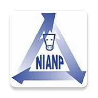

# FeedChart


## Overview

FeedChart is a comprehensive application designed to provide detailed feed recommendations for various types of livestock. The app leverages data on milk yield, body weight, and fodder availability to generate precise feed recommendations, ensuring optimal nutrition and productivity.

## Features

- 📊 **Detailed Feed Recommendations**: Get precise feed recommendations based on milk yield, body weight, and fodder availability.
- 📈 **Interactive Charts**: Visualize feed data with interactive charts and graphs.
- 📝 **Customizable Settings**: Save and customize your preferences for personalized recommendations.
- 🌐 **Multi-language Support**: Available in multiple languages for a global audience.

## Preview


## How to Install?

- ### From GitHub Releases
  1. Go to the [Releases](https://github.com/jeryjs/Feed_Chart/releases/latest) page of the repository.
  2. Download the latest APK file from the list of assets.
      - If you are on a PC, transfer the APK file to your Android device.
  3. Open the APK file on your device to install the application.
  
- ### From Google Play Store (coming soon)
  1. Open the Google Play Store on your Android device.
  2. Search for "[ICAR-NIANP Feed Chart](https://play.google.com/store/apps/details?id=com.borne.root.nianp_feedchart)".
  3. Tap on the "Install" button to download and install the application.

##  Building from Source
- ### Prerequisites
  
  - **Java Development Kit (JDK)**: Ensure you have JDK 11 or higher installed.
  - **Android Studio**: Download and install the latest version of [Android Studio](https://developer.android.com/studio).
  
- ### Steps
  
  1. **Clone the Repository**:
      ```sh
      git clone https://github.com/jeryjs/feedchart.git
      cd feedchart
      ```
  
  2. **Open in Android Studio**:
      - Launch Android Studio.
      - Select `Open an existing project`.
      - Navigate to the cloned repository and select the `feedchart` directory.
  
  3. **Build the Project**:
      - Click on `Build` in the top menu.
      - Select `Make Project` to build the project.
  
  4. **Run the Application**:
      - Connect your Android device or start an emulator.
      - Click on the `Run` button or press `Shift + F10`.

## Usage

1. **Select Animal Type**: Choose the type of livestock from the home screen.
2. **Select Data**: Select the desired data such as milk yield or body weight.
3. **View Recommendations**: Get detailed feed recommendations and visualize them using interactive charts.

## License

This project is licensed under the MIT License - see the [LICENSE](LICENSE) file for details.

---


